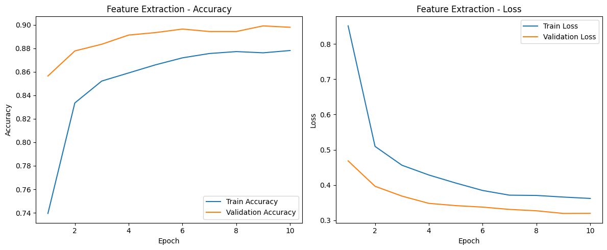
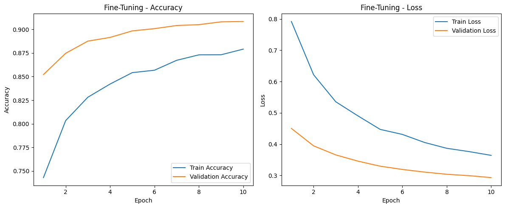

# Experiment Summary

Two transfer learning experiments were performed using **EfficientNetB0** on the **Food11 dataset**.

### Experiment 1 — Feature Extraction

* Backbone: EfficientNetB0 (ImageNet pretrained)
* Base model layers: **Frozen**
* Trainable layers: **Classification head only**
* Learning rate: **0.001**
* Epochs: **10**

**Result**

* Validation Accuracy: **89.91%**
* Validation Loss: **0.3194**

---

### Experiment 2 — Fine-Tuning

* Backbone: EfficientNetB0
* Last **30 layers unfrozen**
* Learning rate: **0.00001**
* Epochs: **10**

**Result**

* Validation Accuracy: **90.84%**
* Validation Loss: **0.2931**

Fine-tuning slightly improved performance compared to feature extraction.

---

# Plots for Metrics

### Feature Extraction Training Curves

Training and validation accuracy and loss:

---

### Fine-Tuning Training Curves

Training and validation accuracy and loss:

---

# Observations

## Feature Extraction vs Fine-Tuning

Feature extraction uses the pretrained EfficientNet backbone without updating its weights and only trains the classifier layer. This approach trains faster and has a lower risk of overfitting.

Fine-tuning allows the model to update some layers of the pretrained network, which helps the model adapt better to the dataset. In this project, unfreezing the last 30 layers improved validation accuracy from **89.91% to 90.84%**.

Feature extraction is useful for a fast baseline, while fine-tuning usually produces better final performance.

---

## Generalization

Generalization refers to how well the model performs on unseen validation data.

In this project, validation accuracy remained close to training accuracy and validation loss decreased steadily during training. This indicates that the model generalized well to unseen data.

Data augmentation and transfer learning helped improve generalization.

---

## Convergence

Convergence describes how quickly the model learns during training.

Feature extraction converged faster because only the classifier head was trained. Fine-tuning required a smaller learning rate and converged more gradually since more parameters were updated.

---

## Overfitting

Overfitting occurs when training accuracy continues improving while validation performance stops improving or worsens.

In this project, training and validation curves improved together and validation loss did not increase significantly. Early stopping and learning rate reduction helped prevent overfitting during training.
